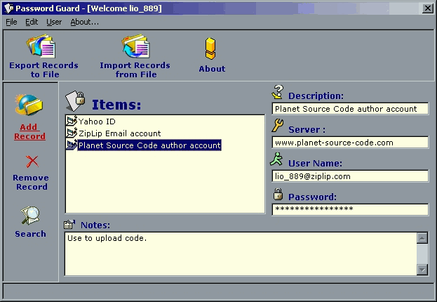



## Password Guard

### Description

Password Guard is a complete application that lets you store User Names, Passwords, Secret Notes easily and securely. You just type your secret information, and it automatically ecrypts, updates, and stores them in your Registry under random sections and keys. You don't even have to worry about saving your work, the powerful AutoSave feature takes care of that! Password Guard uses a professional encryption cipher that utilizes 128-bit encryption, and it can be used by multiple users. Each user has a unique User ID and a Master Password. That's not all, it can Export Data to files, Import Data from files, search records, and much more. It has a very smooth and "iconful" user interface. Check it out!
 
### More Info
 

             |
---                |---
**Submitted On**   |2000-12-25 17:34:12
**By**             |[Lio\_889](https://github.com/Planet-Source-Code/PSCIndex/blob/master/ByAuthor/lio-889.md)
**Level**          |Intermediate
**User Rating**    |4.8 (29 globes from 6 users)
**Compatibility**  |VB 5\.0, VB 6\.0
**Category**       |[Encryption](https://github.com/Planet-Source-Code/PSCIndex/blob/master/ByCategory/encryption__1-48.md)
**World**          |[Visual Basic](https://github.com/Planet-Source-Code/PSCIndex/blob/master/ByWorld/visual-basic.md)
**Archive File**   |[CODE\_UPLOAD1310512272000\.zip](https://github.com/Planet-Source-Code/lio-889-password-guard__1-11617/archive/master.zip)

